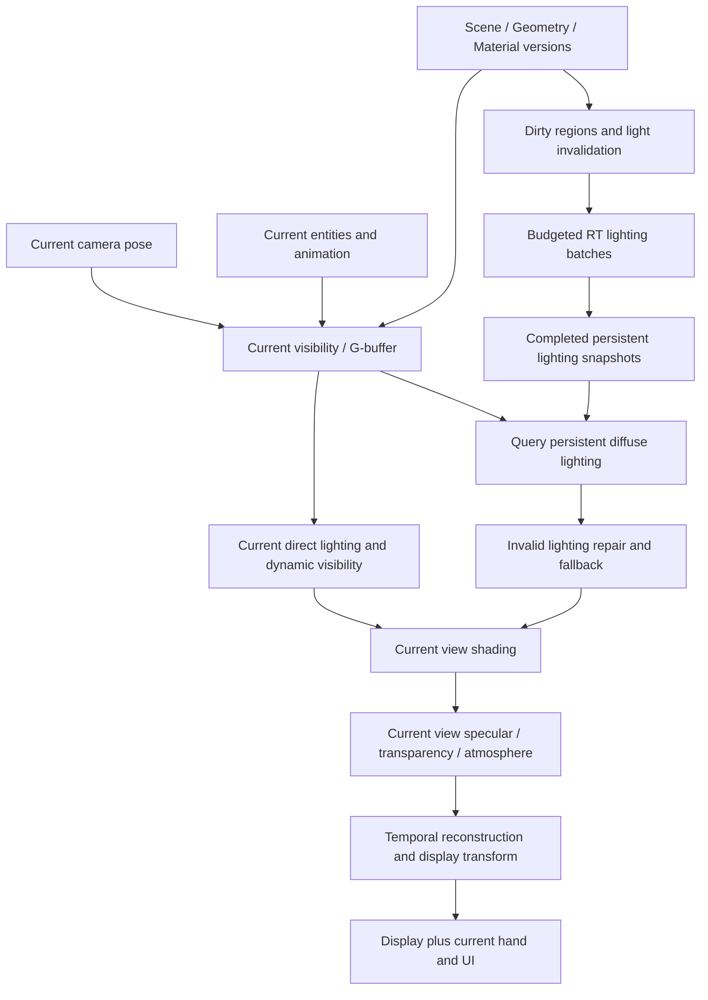

# Persistent RT World + Real-Time View Rendering

状态：研究设计，未实现运行管线。分支：`persistent-rt-world-research`。

## 1. 用户目标与核心合同

RT 维护可复用的世界照明；当前显示帧使用当前相机、当前几何可见性和当前实体状态构造图像。允许部分间接照明较旧，同时要求摄像机移动、实体轮廓、直接光与必要的动态阴影及时响应。

核心表达为：

`E(x,n,t_light) = RTLighting(scene, lightState, budget)`

`Image(t_display) = Shade(CurrentVisibility(camera, geometry, entities), DirectLight(t_display), E, ViewTerms(t_display))`

其中 E 是初期缓存的漫反射入射辐照度，不代表整个 PBR 出射辐射。完整方向辐射若进入后续研究，应显式增加方向维度。相机决定查询位置和可见性，也可以为后台采样提供重要性优先级，但不要求每次相机变化都重算完整 GI。

最终效益来自减少重复计算照明的次数和需要追踪完整路径的区域。每个显示帧仍需可见性、着色、读写与合成；这些成本继续随显示分辨率和刷新率增长，不能把总成本全部写成 SceneChange + NewlyVisiblePixels。

## 2. 主管线

重投影用于复用照明历史和 temporal reconstruction；当前可见性来自 raster G-buffer 或廉价 primary RT，不用旧图的覆盖情况来证明当前无遮挡。修补对象首先是缺失或失效照明，主可见性工作量与昂贵照明修补量分开统计。

## 3. 任务分层

| 层 | 候选任务 | 更新依据 |
| --- | --- | --- |
| Fast | 当前相机、可见性、实体姿态/动画、材质解析、直接光、动态阴影、必要的视角相关项、合成、手持物与 UI | 每个显示帧；目标频率由实测预算决定 |
| Medium | 动态物体间接影响、局部照明修补、部分方向照明更新 | 年龄、视觉重要性、变化事件与预算；不统一按固定帧率跳过 |
| Slow | 静态漫反射 GI、空间辐照度缓存、低变化环境照明采样 | 按事件失效并在预算内渐进更新；稳定状态可复用 |
| Event-driven | 静态几何、材质、局部 BLAS/TLAS、方块变化 | 几何/材质改变时更新，不能因为 RT 照明低频而让当前可见性延后 |

粘贴材料中的 5–30 / 30–60 / 120–240 Hz 是候选工作频率，不是当前 RTset 已达到的指标。初期保留动态阴影快速路径；是否降频必须有实测运动/接触伪影证据。粗糙反射可以研究低频方向辐射更新，但每帧仍以当前反射方向查询，不能直接复用旧相机反射颜色。

## 4. 高频当前可见性

第一阶段比较两条实现路径：

1. Raster G-buffer：静态区块和动态实体在当前相机下写 depth、normal、material、motion。需要一致的 alpha-test、纹理和实例变换。
2. 廉价 primary RT：每像素只取得当前命中，独立记录主射线成本，不立即执行全套阴影/GI/reflection/volume。

当前 RTset 主要在 raygen 内完成着色；需要先拆分几何命中、直接光、间接光与视角项，不能仅设置更新间隔。PBR 法线、POM 和透射的语义必须与现有材质路径一致，早期不覆盖的特性应明确标记。

简单动态实体首先保留当前姿态/动画/可见性。若动态 RT 阴影/反射依赖动画 BLAS，则该构建成本仍在关键路径；不能因为 raster visibility 高频就忽略动态 AS 更新。实体对世界的 GI 影响可采用较慢的采样更新，但强发光实体、近距离接触变化等必须具备高优先级或立即失效机制。

## 5. 空间缓存与照明合同

- 初期保存漫反射 E，当前显示计算 `beta * albedo * E / pi`；一般 PBR 必须保持已有 BRDF 合同，不用 Lambertian 公式覆盖其他闭包。
- 空间坐标采用稳定锚点，材质、法线、区域/光照 generation、更新时间和采样质量一起验证。当前相机可以查询之前未显示的表面；未覆盖区域需要修补或完整路径回退。
- 世界缓存保存世界量；screen depth/material/normal/history 属于采样视图。motion 明确描述时间对，不能作为静态世界属性保存后无限复用。
- 几何、材质、发光和遮挡改变会影响缓存。局部方块变化的 GI 影响可能传播到邻区甚至远处，不能宣称只失效所在 section 就总是正确。初期使用保守受影响区域与有效年龄，再研究依赖传播。
- 拆分静态目标与动态影响，保证动态阴影不通过低频缓存进入 NRD。静态 receiver 也可能接受动态遮挡，不能仅凭 receiver 分类设定静态标记。
- 当前原始工作区的空间哈希实验只有独立合成数据与单批更新，并非真实跨帧世界缓存，本分支尚未引入该实现。

## 6. 阴影与镜面的特殊约束

静态阴影缓存与实时实体阴影可以研究组合，但必须保持采样方向一致。对于同一条采样光线，独立遮挡集合的 RGB 透过率可组合；面积光/太阳盘的两个平均阴影量不能一般性直接相乘：

`mean(T_static * T_dynamic) != mean(T_static) * mean(T_dynamic)`

例如两条光线静态透过率为 [1,0]，动态为 [0,1]，真实联合均值是 0，分开平均后相乘却是 0.25。初期维持完整联合可见性或保存匹配采样信息；不得以标量 shadow cache 覆盖 RGB 透明阴影。

镜面反射随当前视线变化，需要当前反射方向和当前反射可见性。方向探针或粗糙反射缓存是近似，有视差、遮挡与角分辨率限制。玻璃、水与多层透明不可仅用一个旧 depth/color 解决。视线大气仍使用 `surface * T_new + L_new`，不复用旧相机带雾最终颜色。

## 7. 调度与 GPU 预算

两个频率共享一张 GPU。把一次 10–20 ms 更新放到后台，不意味着这次计算不会占用 fast renderer 所需的算力或造成排队。目标预算：

`f_display * C_fast + sum_i(f_i * C_update_i) + W_event <= 1000 GPU ms/s`

此外还要满足 display deadline；120 Hz 的间隔是 8.33 ms，240 Hz 是 4.17 ms。平均预算符合不代表长任务能够及时让出资源。候选机制为小块更新、短提交、可读完成快照与后台工作准入预算。多队列重叠只在依赖、硬件能力与资源争用允许时生效，不能假定一定抢占及时。

RTset 目前使用 Minecraft 帧拥有的 Vulkan encoder，mapped buffer/TLAS 复用依赖已有 fence。初期可以先在同队列中安排短批次，禁止绕过资源退休等待来制造异步。真正独立队列/提交需要单独验证引擎提交所有权、timeline feature、queue family ownership 与 GPU 完成语义。

### 数据所有权

| 数据 | fast reader | updater | 发布规则 |
| --- | --- | --- | --- |
| 静态几何/材质快照 | 当前可见性与照明查询 | 场景发布 | scene version 一致，读者完成后才退休资源 |
| 动态几何/变换 | 当前可见性、必要阴影/反射 | 当前动态更新 | 与当前姿态一致，AS 更新依赖明确 |
| 照明缓存 read | 高频着色 | 不原位写入 | 只消费完整发布且 generation 合法的数据 |
| 照明 write/ready | 无直接读取或仅发布后读取 | 慢更新 | GPU 完成后转 ready，按显式依赖交换 |
| 屏幕 guides/history | 重建 | 当前视图与真实新采样 | display index、sample index 和 epoch 独立 |

队列积压时减少低优先级后台批次，暴露 cache age/backlog；不能通过无限累积旧照明使 FPS 看起来更高。强照明变化与错误遮挡应有立即失效/回退能力。

## 8. NRD 与照明年龄

真实新采样进入 NRD；显示重复查询/复用同一份采样时不新增采样计数或虚增置信度。NRD 是屏幕引导的降噪路径，本身不把低频屏幕图像变成全世界照明缓存。世界缓存滤波与 screen-space NRD 需分别定义，并验证一次反照率处理、匹配 hit distance 和当前 guides。

现有 raygen 将 direct、indirect 和 area lighting 合入同一个 diffuse/specular NRD 通道。新架构不能只增加两个时钟就完成接入：需要定义每个贡献的采样来源与年龄，研究分离照明缓冲、世界缓存滤波和最终 NRD 输入合同。尤其避免把新的直接光与旧 GI 一起混合后，用单一 sample age 宣称两者都得到了新采样。

实体阴影继续使用当前独立贡献路径，维持用户要求。FSR 输入须与当前显示 pose/深度/motion/reactive 对齐，保留当前颜色与遮挡变化。重复照明历史不能被反复当成新独立观察。

慢照明的陈旧程度取决于更新间隔、批次计算和排队，不能只以“20 Hz 等于 50 ms”保证画质。强发光、近场几何变化、闪烁光源和室内外切换可能明显暴露间接照明滞后。使用 age/变化强度/错误度量驱动优先级，允许覆盖默认频率。

## 9. 原型与验证

执行阶段以 [研究计划](persistent-rt-world-research-plan.md) 为准：成本拆分 -> 当前可见性 -> 持久漫反射 -> 预算调度/修补 -> 简单实时实体 -> 场景事件与特殊材质。

固定相机轨迹至少覆盖：原地旋转、连续平移、近距离绕过遮挡、FOV 调整；再加入实体行走/动画/阴影。后续增加开门、方块移除、发光块变化和传送，验证可见性与缓存同时失效。

核心指标：

- primary visibility 成本与实际主射线数量；昂贵 shading/GI repair ratio 分开。
- 当前直接光、动态 AS/阴影、缓存查询、后台更新、修补、NRD/重建及合成各项 GPU time。
- GPU 总工作量、关键路径、排队延迟、display deadline、输入到显示延迟。
- cache age、hit/miss、错误覆盖、漏光、实体阴影残留、修补 backlog。
- 真正更新的 lighting samples/seconds，避免用显示帧数冒充照明更新率。

用户材料中的 16 ms 完整帧、4 ms 显示层与 250 FPS 均为假设示例，不是 RTset 测量。已有日志只有整段 trace 的 36–42 ms 数量级，没有各新模块成本或净收益，当前不能承诺数倍加速。

## 10. 当前决定

采用多频世界照明与实时视图作为研究主路线。优先证明当前相机/实体响应、几何正确性和低频漫反射复用，再用相同画质与分辨率比较工作量和显示截止时间。保留旧深度 warp 作为辅助实验，完整当前视角作为画质参考。

本设计更新只修改文档，没有宣称运行实现已完成，也没有替换 mod。
